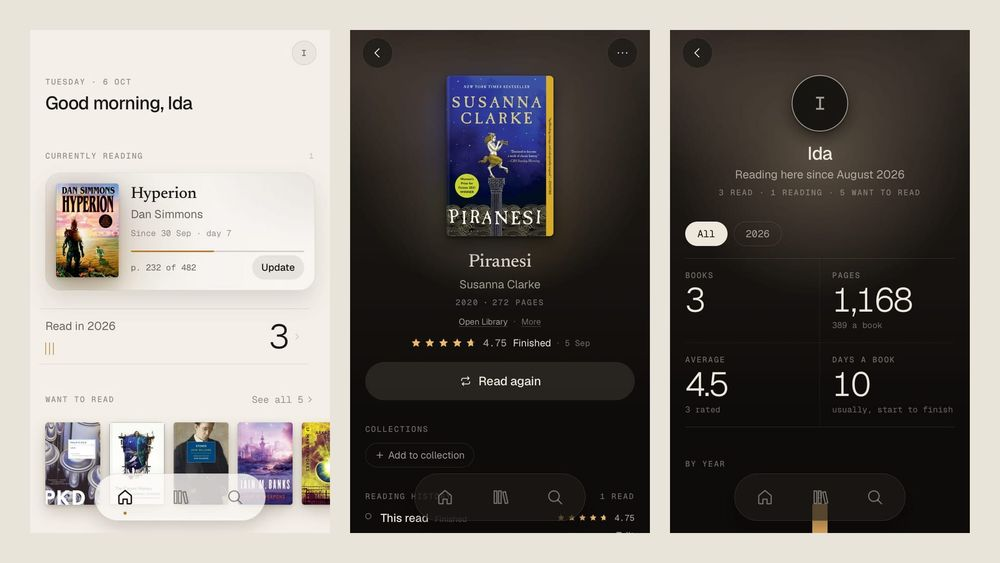
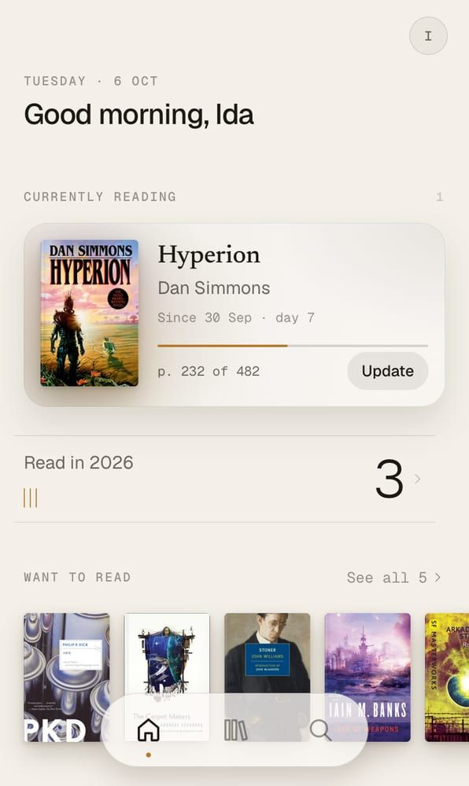
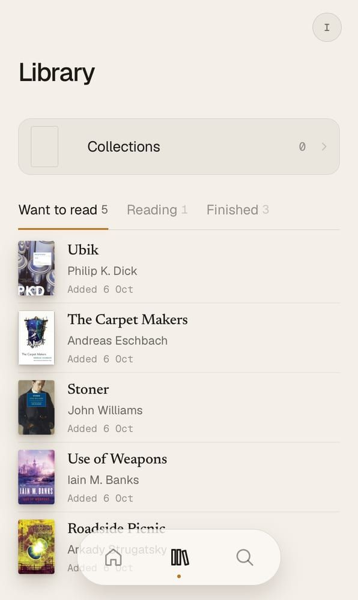
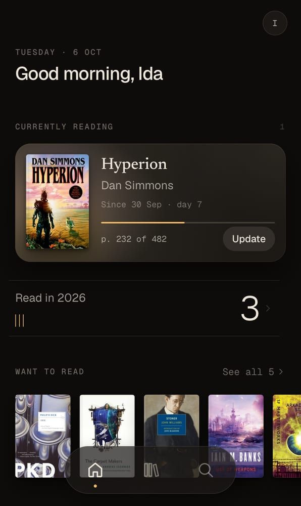
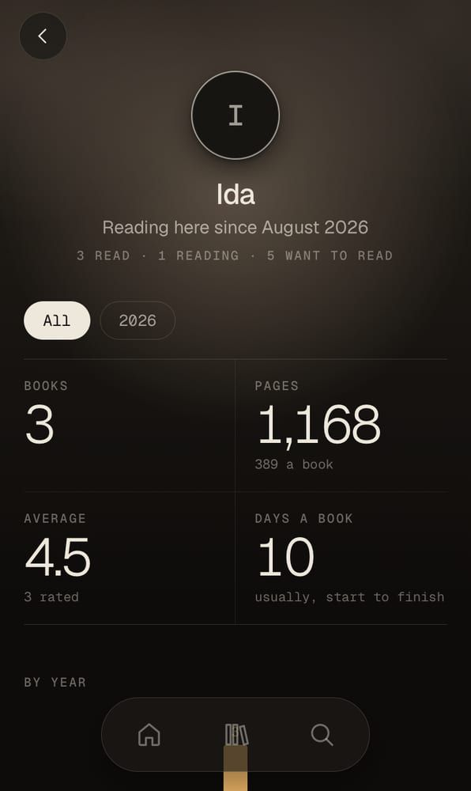

# Libellus

A calm, mobile-first book tracker you install from the home screen: search a book → **Want to
read** → **Currently reading** → **Finished**, with the date, a quarter-star rating and a few words.
Friends can follow what you choose to share, and nothing else: no ads, no trackers. Built web first
on Nuxt and Supabase, with the docs that make a later Swift/Kotlin port mechanical.



Libellus runs as one private, invite-only instance for its owner and a few friends
(libellus.fabkho.dev).

## What it does

- **Find a book fast.** One search field asks Apple Books, Open Library and the instance's own
  Catalogue at once and shows one merged list, one row per book; a barcode scan or an ISBN goes
  straight to the edition. Where a result came from is never shown. Books with no match can be
  typed in by hand and stay private.
- **Every read counts.** Start and finish dates, a rating in quarter stars, a review, re-reads and
  books you put down (DNF) are all reading sessions of their own, editable afterwards.
- **Progress** in pages or percent, with a day-by-day chart and a reading log, and your own page
  count when the edition's is wrong. Change edition keeps the history.
- **Collections**, your own shelves, in your order.
- **Your reading in figures**: the Profile with books, pages, average rating and pace by year, and
  a year in review per year.
- **Bring your history**: drop a Goodreads or Hardcover export (CSV) and it is told apart by its
  header; shelves, lists, every read with its days, ratings and reviews come along. Fable exports
  through the Goodreads format.
- **Book links**: your own short list of links (a library catalogue, a shop) that every Book's page
  offers, filled with its ISBN, title or author. Kept with your account, visible to nobody else.
- **Goodreads' community rating** under a Book's facts, looked up server-side and cached (optional).
- **Works offline**: the Library, Collections and figures are kept on the device; changes made
  offline wait in an outbox and sync once you are back.
- **An app, not a website**: installable (PWA), full screen, share a link from another app to open
  the book, long-press shortcuts, light and dark themes ("Night Reader").
- **Friends, by choice.** Share your follow link and people ask to follow you (your account is private
  until you let them in; a public one can be followed at once). Your switches decide what they see:
  what you are reading, Want to read, what you finished, ratings, reviews, books you put down, your year
  in review. Hide a single Book from them, or block someone.
- **Your circle.** Home shows what the people you follow finished, reviewed or started, and a follow
  request to answer; the feed lists all of it, newest first.
- **Invite-only accounts** with a six-digit code by email; no passwords. Delete your account from
  the app.

| Home (light) | Library (light) | Home (dark) | A Book (dark) | Profile (dark) |
| --- | --- | --- | --- | --- |
|  |  |  |  |  |

## Privacy

One operator, the owner, runs the one instance (libellus.fabkho.dev). This is what that instance
does with your data.

- **No trackers, no ads, no third-party code in the app.** The session is the only thing it
  stores for sign-in; everything else on the device is your own data, kept for offline use and
  removed when you sign out.
- **Page loads are counted, nothing more.** This instance uses Cloudflare Web Analytics, which is
  cookieless and stores no identifier on your device (docs/HOSTING.md).
- **Your data is yours**: row-level security in the database means a member only ever reads her own
  Library, reviews, Collections and Book links.
- **Delete is in the app**: Profile → Account → Delete account removes your account and everything
  of yours (Library, reading sessions, ratings, reviews, Collections, name, photo, sign-in) from the
  database at once. The encrypted nightly backups below forget it when they expire, within 35 days.
  An export of your data is planned; until it exists, the app only imports (Goodreads, Hardcover).
- **Sharing is opt-in**: a member's reading page is off until she turns it on, shows only the
  sections she picks (never her email, notes, highlights or a review she didn't share), sits at an
  unguessable link out of search engines, and dies at once when she makes a new link or turns it off.
- **The waitlist is the only address a visitor can leave**: a reading page ends in a small form
  ("Libellus is invite-only for now"); the address is kept only to send an invite, readable only by
  the owner and deleted on request. No account is made from the page.
- **Search stays plain**: the browser asks Apple Books and Open Library directly for the words you
  type, nothing else; the Goodreads rating is looked up by the server, so Goodreads never sees you.
- **The reader asks outside services only for the words you select**: *Translate* (the browser's own
  translator where there is one, otherwise MyMemory) and *Define* (Wiktionary). The book itself never
  leaves your device.
- **Errors stay in this instance's database**: the app reports its own crashes (message, stack,
  screen, app version; never a Book, note or search) to a table in its Supabase (`eu-central-1`),
  kept 30 days, readable only by the owner (docs/OPERATIONS.md). No third-party error service.

**Where your data lives.** These are the services that store or process it for the owner:

| Service | What it holds or does |
| --- | --- |
| [Supabase](https://supabase.com), region `eu-central-1` | The database (Postgres), sign-in (Auth), profile photos (Storage) and the edge functions: everything you save, your email address, the waitlist and the error log |
| [Cloudflare Pages](https://pages.cloudflare.com) | Serves the app's static files and the link previews of a shared reading page; Cloudflare Web Analytics counts page loads from there |
| [Cloudflare R2](https://developers.cloudflare.com/r2/) | A private bucket with the nightly database backup, encrypted before it is uploaded with a key only the owner holds; each file is deleted after 35 days (docs/OPERATIONS.md, "Backups") |
| Resend (an email provider, over SMTP) | Sends the six-digit sign-in codes and the waitlist invites, so it sees the address it mails |
| [GitHub](https://github.com) | The code and its CI. None of your data: the backup job encrypts the dump while it streams and keeps no artifact or log of it |

## Tech stack

| | |
| --- | --- |
| App | [Nuxt 4](https://nuxt.com) as a single-page app (`ssr: false`), Vue 3, TypeScript, Pinia, Tailwind CSS v4 on generated design tokens, `@vite-pwa/nuxt` |
| Backend | [Supabase](https://supabase.com): Postgres with the rules in the database (constraints, triggers, RPC, RLS), Auth (email codes), two Deno edge functions |
| Hosting | Static files on Cloudflare Pages (any static host works) |
| Tests | pgTAP for the database, Vitest for the data layer against a real local stack, Playwright flows in WebKit at iPhone size |

## Quick start (local)

Needs access to this repository, Docker, Node 24, pnpm and the [Supabase CLI](https://supabase.com/docs/guides/local-development/cli/getting-started).

```sh
# clone this repository
git clone https://github.com/fabkho/libellus && cd libellus
supabase start                 # the local stack on ports 55320–55329: Postgres, Auth, Studio, a mail catcher
cd web
cp .env.example .env           # paste the anon key `supabase start` printed
pnpm install
pnpm dev                       # http://localhost:3020, best in a phone-sized viewport
```

Sign in as `dev@libellus.local` (the six-digit code lands in the local mailbox at
http://127.0.0.1:55324), or sign up with any address and the invite code `LIBELLUS-DEV`. Tests,
design tokens, the layout of the repository and everything else for working on the code:
[docs/DEVELOPMENT.md](docs/DEVELOPMENT.md).

## Documentation

| | |
| --- | --- |
| [docs/SETUP.md](docs/SETUP.md) | Setting up the owner's instance: Supabase, Cloudflare Pages, invites, every setting in one table |
| [docs/DEVELOPMENT.md](docs/DEVELOPMENT.md) | Run, test and change it locally |
| [docs/HOSTING.md](docs/HOSTING.md) | How the owner's instance is built and served on Cloudflare Pages |
| [docs/OPERATIONS.md](docs/OPERATIONS.md) | The client error log and how to read it |
| [docs/TESTING.md](docs/TESTING.md) | The test suites, CI, and checks on a real Android device |
| [SPEC.md](SPEC.md), [CONTEXT.md](CONTEXT.md) | The spec sheet and the domain words |
| [docs/DESIGN.md](docs/DESIGN.md), [docs/MOTION.md](docs/MOTION.md) | The design system ("Night Reader") and its motion |
| [docs/parity.md](docs/parity.md) | Per-screen behaviour, the reference for a native port |
| [docs/OWNER.md](docs/OWNER.md) | Tooling only the owner's instance uses (the Fable import, the 3D shelf) |

## Contributing, security, license

Libellus is a personal project and the repository is private: issues and pull requests are for the
owner and the collaborators invited to it ([CONTRIBUTING.md](CONTRIBUTING.md)). Please report
security problems privately ([SECURITY.md](SECURITY.md)).

**License: [MIT](LICENSE).** The 3D shelf (Regal) is a separate, private layer and not part of this
license; Libellus builds and runs without it.
