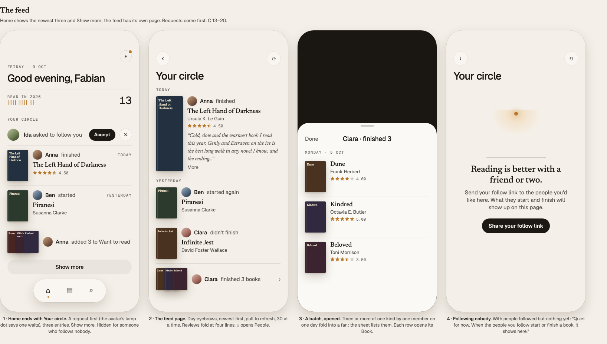
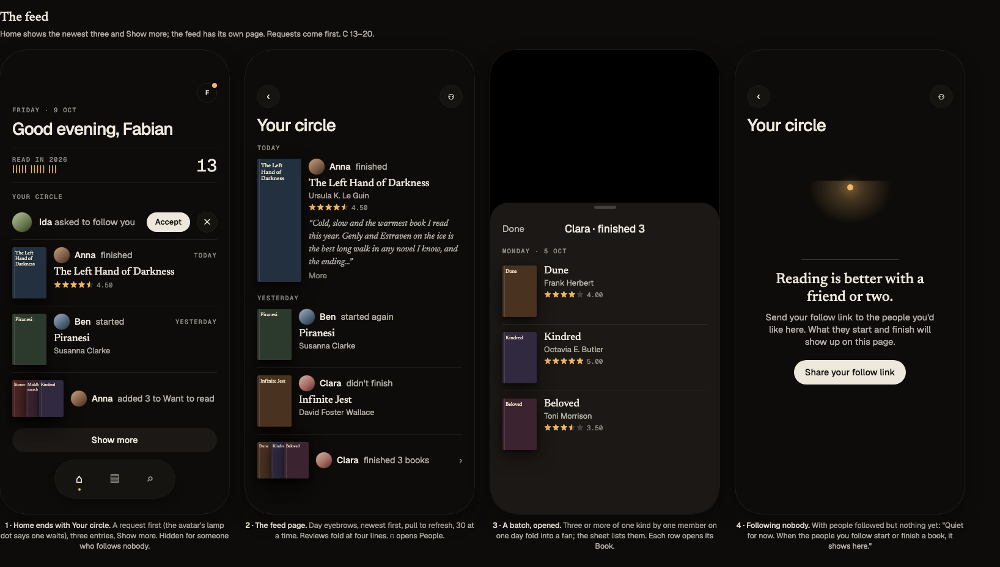
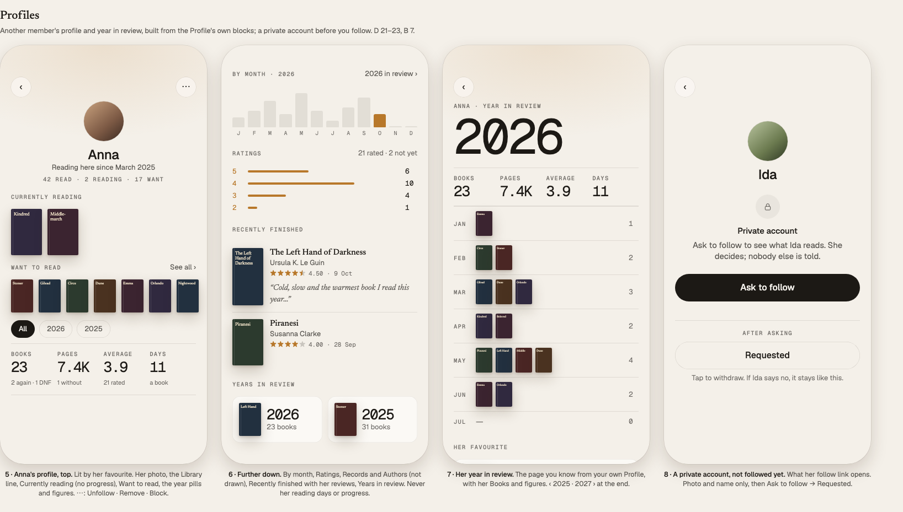
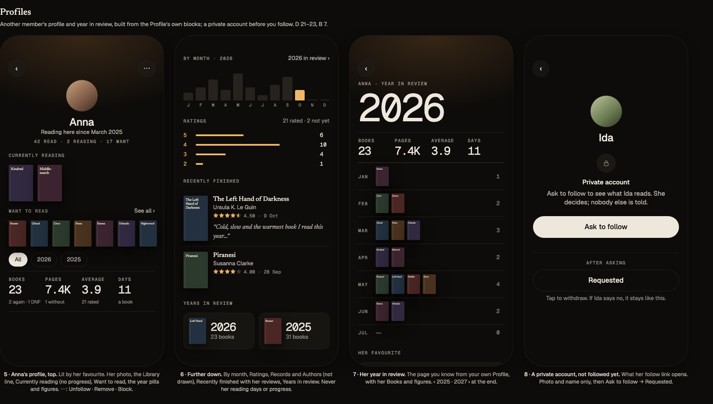
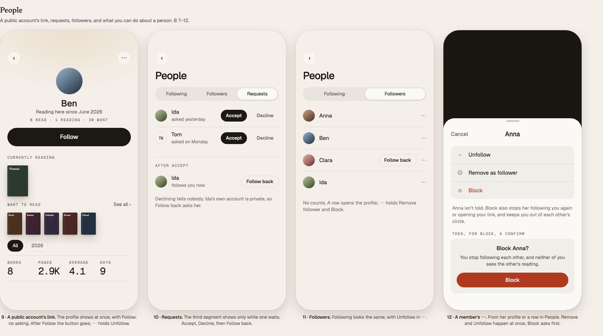
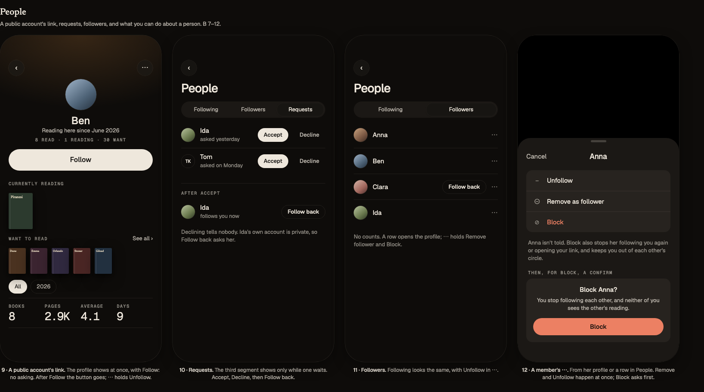
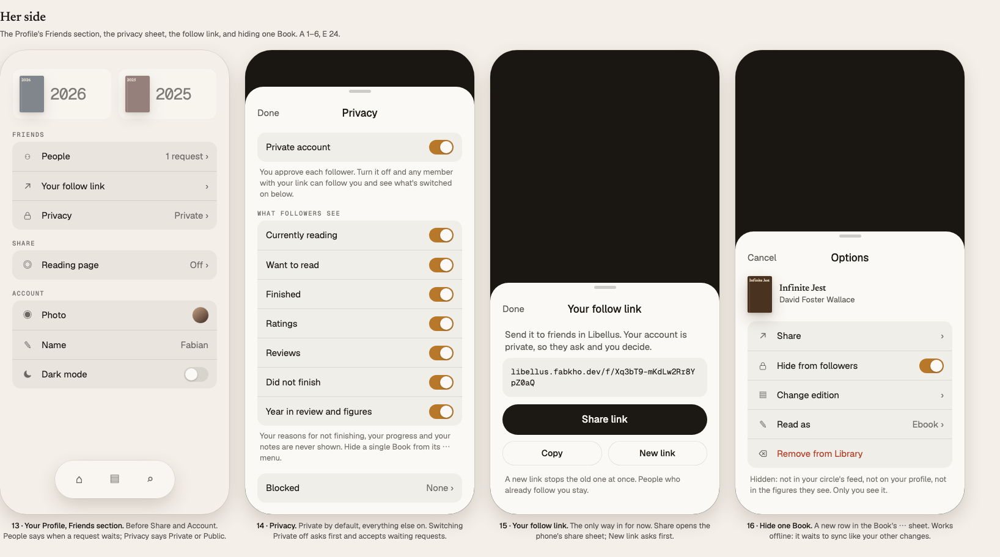
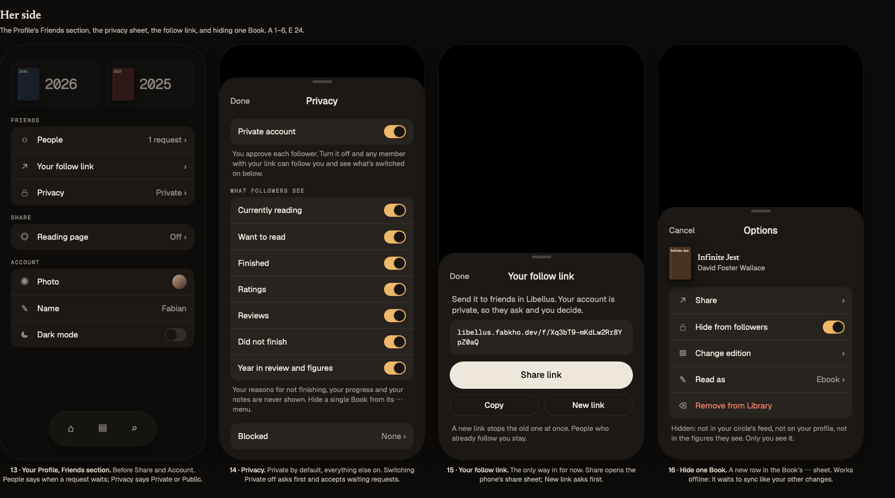

# Social, version 1: the scope

The owner's answers to [social.md](social.md) §10 (8 October 2026), turned into what version 1 ships.
`social.md` stays the research behind it: the data designs, the RLS reasoning, the ideas. Where
the two differ, this file wins.

Mocks of every version 1 screen, in both themes: [`social/mock.html`](social/mock.html) (open it in
a browser; *Switch room* flips light and dark) and its screenshots, screens 1–16 (each caption names the
features it shows, by the letters and numbers of the list below):

| | Light | Dark |
|---|---|---|
| The feed (1–4) |  |  |
| Profiles (5–8) |  |  |
| People (9–12) |  |  |
| Her side (13–16) |  |  |

## Decisions

| # | Question | Answer |
|---|---|---|
| 1 | Consent model | **Like Instagram: a private account by default.** A private account approves each follower (a request she accepts or declines). A **public** account can be followed by any member who reaches her profile, without asking. |
| 2 | Finding each other | **The follow link only**, for now. Other ways (the reading page, an address, suggestions) maybe later. |
| 3 | What followers see by default | **Everything on**, reviews and Did not finish included. Each stays a switch she can turn off. |
| 4 | Manual books and own editions | **Shown to followers like any Book**, unless she hides one (below for the reasons against and the copy that changes). |
| 5 | Where the feed lives | **On Home**: a few entries and **Show more**, which opens the whole feed on its own page. No new tab. |
| 6 | Followers see her photo | **Yes.** |

Kept from the proposal without a question: the 10-minute settle window, imports and old reads
never make an entry, no counts or likes, no notifications, the outbox never queues a follow-related
write, nothing visible to anyone until she lets a follower in (or makes her account public).

### Question 4: what speaks against showing Manual books

Three things, none of them a reason to hide them by default:

- **The app promises the opposite today.** `manual.private` says "Only you can see this book. It
  stays out of the shared catalogue." and `ownEdition.private` "Only you can see your edition. …"
  (`web/i18n/locales/en.json`, under the Manual book and My edition isn't listed sheets). Both become
  untrue the day a follower sees her reads. They change to: "It stays out of the shared catalogue.
  Your followers see it with your reads; hide it from them in its ⋯ menu." CONTEXT.md's "Manual book
  — … Private to that Member" changes the same way: private to her *Library*, not secret from her
  followers.
- **A follower cannot open it.** `books_readable` lets only the owner read a Manual book's row, so
  its cover in the feed or on her profile opens nothing (the row is still shown, with its title,
  authors and her stars).
- **Typed-in books can be personal** (a draft, a work file, a diary kept as a "book"). Rare, and that
  is what *Hide from followers* is for.

Against hiding them: her own edition is a Manual book (SPEC.md, Decisions), used for ordinary
paperbacks no source knows. Hiding all Manual books would make normal reads vanish from her feed and
make the figures her followers see disagree with the covers they see. The public reading page
already shows them (`private.reading_page_reads` joins `books` without an owner filter).

## Version 1: what is included

### A. Her privacy

1. **Private account**, on by default for every member, existing ones included. While it is on,
   nobody sees anything of hers until she accepts their request.
2. **Public account**: switching *Private account* off lets any member who reaches her profile
   follow at once and see it without following. Requests still waiting are accepted when she goes
   public (as Instagram does), after a Confirm that says so. Going private again keeps the
   followers she has.
3. **What followers see**: seven switches, all on by default: Currently reading, Want to read,
   Finished, Ratings, Reviews, Did not finish, Year in review and figures. A switch applies to the
   feed, her profile and her figures at once, including what happened before it was turned off. The
   reason she gave for not finishing never leaves her Library; the switch shows only that she put the
   Book down.
4. **Hide from followers**, per Book, in the Book's ⋯ sheet. A hidden Book is gone for everyone else
   from the feed, her profile, her counts and her figures. It waits in the outbox offline like the
   other changes to her own Books.
5. **Your follow link** (`/f/<token>`, 128 random bits): **Share** (the share sheet), **Copy**, **New
   link** (the old one stops working, behind a Confirm). It exists from the first time she opens
   Friends; it does not depend on the account being private or public.
6. **Blocked**: the members she blocked, each with **Unblock**, at the end of the settings sheet.

### B. Following

7. **Opening someone's follow link** (signed in) opens her profile. Signed out, Sign in comes first
   and then the profile.
   - Public account: the full profile and **Follow**.
   - Private account: her photo, name and "Private account. Ask to follow to see her reading.",
     **Ask to follow**; once asked, **Requested** (tap to withdraw).
   - Already following: the full profile.
   - Her own link: her own Profile.
   - A dead link, or someone who blocked you: "This link isn't here any more." Nothing says why.
8. **Follow requests**: a quiet row at the top of Home's *Your circle* ("Ida asked to follow you"),
   the Requests segment of *People*, and the value of the Profile's *People* row ("1 request"). A
   lamp dot on the header's avatar while one waits, no number. **Accept** or **Decline**; declining
   tells nobody, and to the asker it stays "Requested".
9. **Follow back**: after accepting, the row offers **Follow back** (a request or an instant follow,
   by the other's privacy). The same button sits next to any follower she does not follow yet.
10. **People** (`/friends/people`): **Following**, **Followers**, **Requests** (when there are any).
    Rows: photo, name, a chevron to the profile. No counts anywhere.
11. **Unfollow**, **Remove follower**, **Block**: from a member's ⋯ (on her profile) and a row's ⋯ in
    People. All silent. Block removes both directions, refuses her requests and link visits and
    hides each from the other everywhere.
12. **Limits**: 150 follows, 20 open requests, 30 follow calls an hour (`follow_limit`,
    `rate_limited`).

### C. The feed

13. **Your circle on Home**, last, after *Next in your series*. The newest **3** entries and **Show
    more** to the feed page. A pending request comes first as its own row. Hidden altogether for a
    member who follows nobody and has no request: Home does not nudge anyone to be social.
14. **The feed page** (`/friends`, pushed). Newest first, grouped under day eyebrows (Today,
    Yesterday, Monday, 3 Oct), 30 at a time, more as she scrolls. Pull to refresh. The ⚇ button at
    the top right opens People.
15. **Entries**: started (and "started again" for a re-read), finished (with her stars and her
    review, the first four lines with **More**), did not finish, added to Want to read, reviewed (a
    review written after the finish). A rating changed later shows as the current stars, never as an
    entry of its own.
16. **Batches**: three or more of the same kind by the same member on the same day fold into one row
    with a fan of covers ("Clara finished 3 books"), which opens a sheet with the Books.
17. **Never an entry**: imports (Goodreads, Hardcover, the owner's Fable import), a finish or DNF
    logged with an end more than 14 days back, anything in its first 10 minutes (a correction inside
    them replaces it), a hidden Book, a switched-off section.
18. **Tapping**: a cover or title opens the Book page (the cover flies as everywhere else; a Manual
    book opens nothing); the name or photo opens her profile; a batch opens its sheet.
19. **Offline**: the last page the device saw, with "Offline · as of 14:02". A copy older than 7
    days is not shown. Signing out deletes it.
20. **Empty states**: following nobody: "Reading is better with a friend or two." with **Share your
    follow link**; following people, nothing yet: "Quiet for now. When the people you follow start
    or finish a book, it shows here."

### D. A member's profile and year in review

21. **Her profile** (`/friends/<member>`), lit by her favourite cover like the Profile: photo or
    initials, name, "Reading here since …", the Library line (read · reading · want). Then, by her
    switches: Currently reading (covers, "since 3 Oct", no progress), Want to read (the newest 12,
    then **See all**), the year pills with the four figures, By year / By month, Ratings, Records,
    Authors you return to, Recently finished (stars, the day, the review folded at four lines), Years
    in review. Her ⋯: Unfollow · Remove as follower · Block.
22. **Her year in review** (`/friends/<member>/<year>`): the months as rows of covers, the favourite,
    ratings, records, authors and the years either side, as on your own. Never her reading days or
    progress.
23. **Not on her profile in version 1**: her Collections, her reading days, her highlights, "you
    both read" (version 2).

### E. Her own Profile

24. A **Friends** section before *Share*: **People** (value: "1 request" when one waits), **Your
    follow link**, **Privacy** (opens the *Friends and sharing* sheet: Private account, What
    followers see, Blocked). The *Reading page* row stays where it is, under *Share*.

### F. Under the hood

- **Database** (one migration, pgTAP): `social_settings` (`private` default true, the seven
  switches, `follow_token`), `follows` (`accepted_at` null = a request), `blocks`,
  `library_entries.hidden`, `activity` with its triggers, the quiet flag
  in `import_books` / `import_book_for`, `feed()`, `member_profile()`, `member_reading_record()`
  (rows in `SESSION_COLUMNS`' shape, so `data/stats.ts` computes her figures unchanged),
  `follow_target(token)`, `follow()`, `answer_request()`, `unfollow()`, `remove_follower()`,
  `block()`, `unblock()`, `set_private()`, `set_social_sections()`, `renew_follow_link()`,
  `set_entry_hidden()` (also in `sync_write`), the avatars select policy for followers (and for any
  member while the account is public), `purge_activity()` on pg_cron. `delete_my_account()` needs no
  change: everything cascades.
- **Web**: `data/social.ts`, `data/feed.ts` (batching, framework-free), `stores/social.ts`,
  `stores/feed.ts`, `stores/memberStats.ts`; pages `friends/index.vue`, `friends/people.vue`,
  `friends/[member]/index.vue`, `friends/[member]/[year].vue`, `f/[token].vue`; Home's
  `components/home/Circle.vue`; `components/friends/*` (Row, Batch, BatchSheet, Hero, RequestRow,
  MemberSheet); the `Hero` and the Profile blocks taking a member; the error log reporting
  `/friends/[member]`, never the id.
- **Offline**: every follow-related write and every switch is online-only and says "Offline";
  only *Hide from followers* waits in the outbox.
- **Copy and docs**: `photo.private`, `manual.private`, `ownEdition.private`,
  `profile.deleteAccount.text`, `sharing.about`; SPEC.md (non-goals, decisions, data model, screens,
  privacy), CONTEXT.md (Follower, Follow request, Private account, Public account, Follow link,
  Circle, Hidden from followers; Manual book), README's intro and *What it does* (its Privacy section
  is #212's), parity.md entries for every screen above.
- **Tests** (end-to-end only where it is critical, decided 8 October 2026): pgTAP as four real members
  (private, public, follower, stranger) for every rule of who sees what; Vitest for the repositories,
  the batching and the figures; **one** Playwright flow for the whole loop with two members (link →
  ask → accept → a finish in the feed → her profile → hide → gone → block); one accessibility scan
  of the new screens in one theme, tagged `@full`.

### Build order

Tasks, models, order and checks: [social-v1-plan.md](social-v1-plan.md).

## Version 2

**Order (owner, 9 October 2026, after version 1 shipped):** first the version 1 debt (below), then
**2a** as one wave: spoiler-safe reviews (1), likes (2), you both read (4), reading the same book now (7),
friends' Want to read on yours (8). Then 2b (readers on a Book's page and finding people: 3, 6), then 2c
(GIFs 9; *Send a book* 5 still a maybe).

**Version 1 debt:** HTTP 404/429 for the named refusals (today 500); paging in People; an end-to-end
guard that fails a flow on an uncaught page error; *See all* with its count; one favourite card shared
by the two year pages; a two-digit batch that wraps; one quiet empty/error block; and the Catalogue
trusting its first adder's title, description and cover (a design to decide first).

The owner's answers to the proposed list (8 October 2026): yes to 1, 3, 4, 7 and 8; likes instead of
*Want to read too* (2); *Send a book* maybe (5); people found through reviews on a Book's page (6);
and a new idea, GIFs and stickers in reviews. Not scheduled yet: version 1 comes first.

| # | Feature | Status | Effort |
|---|---|---|---|
| 1 | **Spoiler-safe reviews.** "Contains spoilers" on the Finish and Edit read sheets; followers who have not finished the Book see the review folded behind *Show anyway*. | yes | S |
| 2 | **Likes.** A heart on a feed entry (a finish, a review) and on a review wherever it shows. See *Likes* below for how they stay calm. | yes, instead of *Want to read too* | S–M |
| 3 | **Readers on a Book's page.** A *Readers* section under the Goodreads line: the people you follow who read it, with their stars, status and review, matched by work so other editions count. Grows into 6. | yes | M |
| 4 | **You both read.** On a profile and her year in review: the Books you both finished, both your stars side by side. No totals. | yes | S |
| 5 | **Send a book.** Book ⋯ → *Send to…* a follower, with a note; a *For you* row on Home, not in the feed. | maybe | M |
| 6 | **Finding people through their reviews.** See *Finding people* below. | yes, the Book page's reviews first | M |
| 7 | **Reading the same book now.** Small photos of followed members who have the same work open, on your Home card. | yes | S |
| 8 | **Friends' Want to read on yours.** A tiny photo on Books a followed member also wants to read. | yes | S |
| 9 | **GIFs and stickers in reviews** (KLIPY). See *GIFs and stickers* below. | new idea | M |

### Likes

Likes replace *Want to read too*. To keep them from becoming a score:

- **A number on the heart; names for the author.** (Owner, 9 October 2026, replacing "who, not how
  many": names do not scale to a hundred likes.) The heart shows how many liked the entry to everyone
  who can see it; only the entry's author can open the list of who liked it.
- **She hears once.** The author gets one quiet row in her *Your circle* ("Anna liked your review of
  Piranesi"), no notification and no badge.
- **Private stays private.** A like is visible only to people who can see the entry, and goes when the
  entry goes (a hidden Book, a removed follower, a block).
- **One kind.** A heart, no reactions palette.
- Data: `likes(member, activity)` (or `session` for a review on a Book page), unique per pair, read only
  through the feed and profile functions that already check who may see what.

Open: should liking a finish also offer *Add to Want to read* in the same tap (a long-press)? It keeps
what 2 was meant to do.

### Finding people (6)

Starting point: the Book page's *Readers* section (3) becomes the place to discover readers, not only
to see friends:

1. **Reviews from members you don't follow yet**, on a Book's page, below your circle's: only from
   **public** accounts with reviews switched on, one line each with photo, name, stars and the review
   folded. Tapping the name opens her profile with **Follow**. Private accounts never appear to
   strangers. This is the main new way in, and it fits the app: people meet over a book they both read.
2. **A follow QR code.** Your follow link as a QR code in the follow link sheet: one scan in person (a
   book club, a reading retreat) instead of sending a link.
3. **Ask to follow from a reading page** for signed-in visitors (from the earlier list).
4. **The waitlist invite carries a follow request** from the member whose page the newcomer came from.

Left out: search by name, a directory, suggestions ("people you may know"): they show who is a member
to everyone.

### GIFs and stickers in reviews (9)

[KLIPY](https://docs.klipy.com/getting-started) is a GIF, sticker, clip and meme API with a Tenor-compatible
set of endpoints for apps moving off Tenor: search, trending, categories, per-user recents, content
ratings. Free, paid for by ads it can mix into results. What that means here:

- **Ads: only if asked for.** Ads come back in Trending, Search and Recent when the request carries the
  ad parameters (`customer_id` and the `ad-min/max-width/height` sizes, plus device fields up to the
  advertising id). Libellus sends none of them: no ads, and no device data leaves.
- **Attribution is required**: KLIPY's brand visible in the picker (their guideline: "Search KLIPY" as the
  field's placeholder, a "Powered by KLIPY" mark) and any credit their results carry. A small line in
  the picker, nothing in the review itself.
- **Content filter**: `ContentFilter` defaults to *off*; it would be set to the strictest level, fixed
  in the server.
- **Privacy**: the README promises no third-party code and that search goes out plain. So the picker's
  searches go through a small edge function (like `goodreads-rating`), with the key on the server and
  no member id sent; the device never talks to KLIPY for search. The chosen GIF is shown from KLIPY's
  media address, which every follower's device then loads: either accepted and named in the Privacy
  section and the sub-processor list (#212), or the media proxied or copied too. Whether copying is
  allowed under their API terms is to be checked; their terms forbid misrepresenting the origin.
- **Editor: no Tiptap.** Reviews stay plain text (the database's `review` column, the outbox's
  arguments, a native port's `TextField` all stay as they are). A review gets up to two attachments
  (`review_media`: session, KLIPY id, kind, address, width, height, its credit), chosen in a sheet from
  a GIF button next to the review box and shown under the text. A rich-text editor would be needed for
  GIFs *inside* sentences or styled text; neither is worth an editor dependency and a new review format.
- **With spoilers (1)**: the spoiler fold covers the review's text and its GIFs together. Inline spoiler
  spans (`||the twist||`, as Discord writes them) would work in plain text too, if wanted later.
- **On the public reading page**: GIFs of a shared review would show to anyone with the link, so they
  follow the review's own sharing switch.

Effort M: the edge function, the picker sheet, the attachment table and its RLS, the display in the
feed, profile and Book page, the Privacy text.

After version 2: reading together (buddy reads with progress and page-pinned notes), *Our year*
for the circle in December, shared Collections, a weekly letter by email, *Ask my circle*, and the
small games (social.md §8). Notifications only for things addressed to you, and only once the app
is a home-screen or Play app (#102).
